# 🌌 VocabVortex: The Next-Generation Contextual Vocabulary Ecosystem

<div align="center">


[](https://expo.dev/)
[](https://reactnative.dev/)
[-000000?style=for-the-badge&logo=next.js&logoColor=white)](https://nextjs.org/)
[](https://groq.com/)
[](https://www.mongodb.com/)
[](https://www.typescriptlang.org/)
[](https://opensource.org/licenses/MIT)
[](http://makeapullrequest.com)

<p align="center">
  <b>Transforming passive vocabulary memorization into an active, immersive flow state.</b><br>
  Powered by Groq's sub-second LPU inference, synchronized movie subtitles, literary flow reading, and gamified arcade battles.
</p>

[Explore Features](#-interactive-showcase--visual-tour) •
[System Architecture](#-%EF%B8%8F-system-architecture) •
[Tech Stack](#-%EF%B8%8F-technology-stack) •
[API Reference](#-restful-api-reference) •
[Getting Started](#-getting-started--local-development) •
[Testing Suite](#-testing--quality-assurance)

---

</div>

## 💡 The Philosophy: Why VocabVortex?

Traditional language learning apps rely on disconnected flashcards and repetitive rote drills. The result? **Learner fatigue and low retention.**

**VocabVortex** was engineered around the **Contextual Immersion Methodology (CIM)**:
1. **Never Learn a Word in Isolation:** Every word lives inside rich literary passages, authentic cinematic dialogues, or AI-generated micro-stories.
2. **Sub-Second Global Word Tap:** Tap any unfamiliar word across the entire application to instantly receive CEFR-calibrated definitions, Bengali localized translations, phonetic transcriptions, and active sentence drills.
3. **Multi-Sensory Reinforcement:** Pair visual word insights with native Text-to-Speech (TTS), time-aligned movie playback, and fast-paced gamification to anchor vocabulary into long-term memory.

---

## 📱 Interactive Showcase & Visual Tour

<table>
  <tr>
    <td width="50%" align="center">
      <b>🚀 1. Discovery Vortex & Level Calibration</b><br><br>
      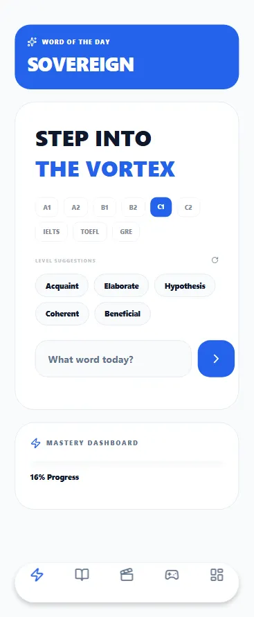<br><br>
      <sub>Personalized home feed featuring Word of the Day, CEFR level selection (A1–C2, IELTS, TOEFL, GRE), smart suggestions, and mastery progression.</sub>
    </td>
    <td width="50%" align="center">
      <b>💡 2. Global Word Insight & Context Drills</b><br><br>
      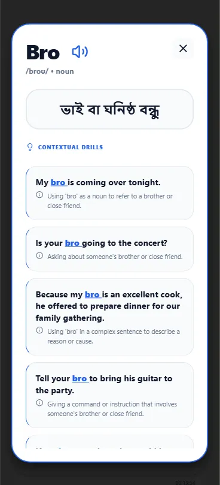<br><br>
      <sub>Instant modal triggered from anywhere in the app with phonetic pronunciation, localized Bengali definitions, and contextual grammatical drills.</sub>
    </td>
  </tr>
  <tr>
    <td width="50%" align="center">
      <b>🎬 3. Cinema Library & Subtitle Search</b><br><br>
      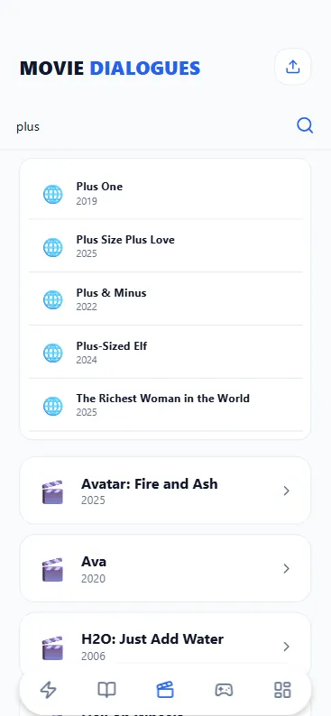<br><br>
      <sub>Searchable film catalogue with external <code>.srt</code> ingestion, subtitle dialogue indexing, and instant movie scene exploration.</sub>
    </td>
    <td width="50%" align="center">
      <b>⏱️ 4. Synchronized Subtitle Explorer</b><br><br>
      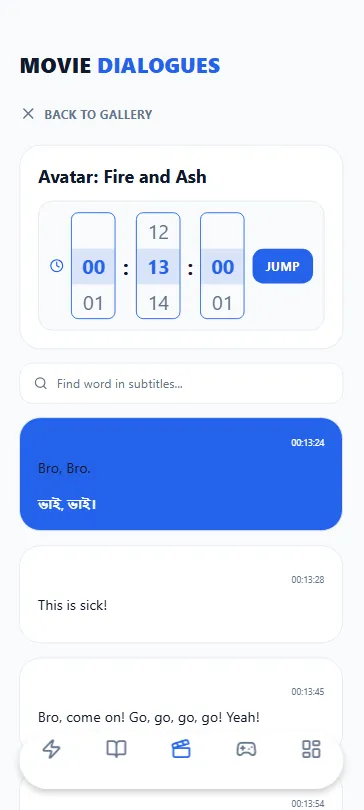<br><br>
      <sub>Time-scrubbed subtitle playback with dual English-Bengali translation, instant timestamp jump navigation, and in-dialogue word exploration.</sub>
    </td>
  </tr>
  <tr>
    <td width="50%" align="center">
      <b>📖 5. ReadFlow Literary Engine</b><br><br>
      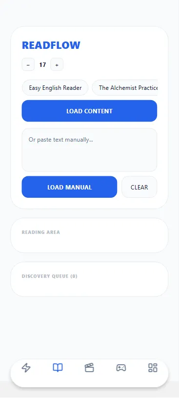<br><br>
      <sub>Distraction-free reading environment with preset literary classics, manual text injection, custom typography scaling, and real-time discovery queues.</sub>
    </td>
    <td width="50%" align="center">
      <b>🕹️ 6. The Arena: Gamified Arcade Hub</b><br><br>
      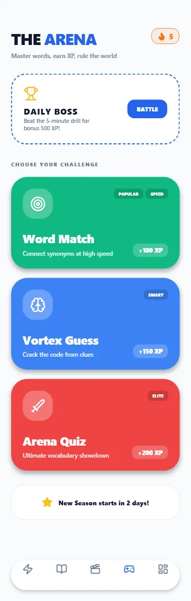<br><br>
      <sub>Competitive training arcade with Daily Boss Challenges (+500 XP), daily streaks, season countdowns, and dynamic game modes.</sub>
    </td>
  </tr>
  <tr>
    <td width="50%" align="center">
      <b>⚡ 7. Word Match: Speed Association</b><br><br>
      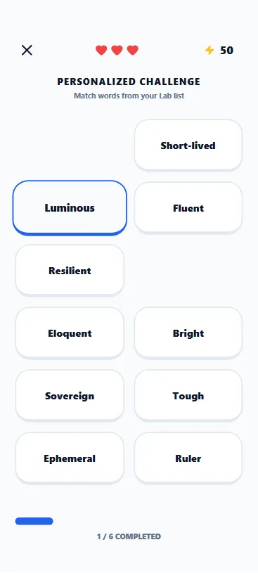<br><br>
      <sub>High-octane synonym and antonym connection challenge generated directly from your personal bookmarked mastery list.</sub>
    </td>
    <td width="50%" align="center">
      <b>🧩 8. Vortex Guess: Clue Deduction</b><br><br>
      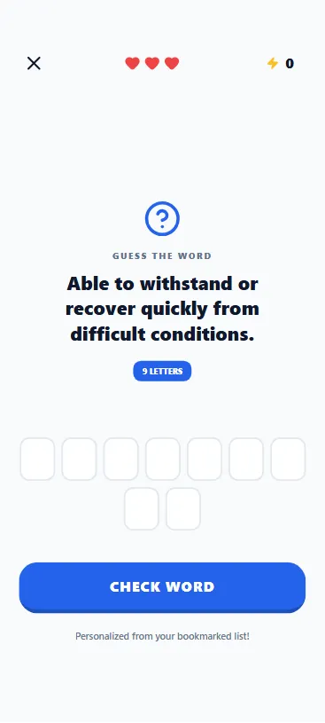<br><br>
      <sub>Context-driven vocabulary puzzle with heart-based life mechanics, letter length hints, and adaptive difficulty.</sub>
    </td>
  </tr>
  <tr>
    <td colspan="2" align="center">
      <b>🏆 9. Your Lab: Profile Analytics & Global Leaderboard</b><br><br>
      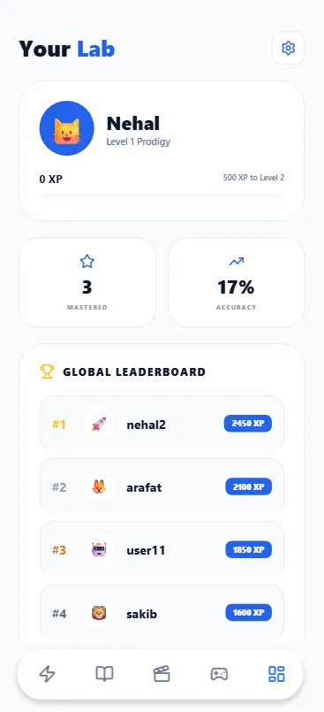<br><br>
      <sub>Real-time XP tracking, mastery level badges ("Level 1 Prodigy"), accuracy percentage, and cross-platform global leaderboard rankings.</sub>
    </td>
  </tr>
</table>

---

## 🌟 Core Feature Modules

### 1. ⚡ The "Global Word Tap" Event Bus
VocabVortex eliminates friction. While reading a book or examining a movie dialogue, you never have to leave your screen to look up a word.
* **Non-Disruptive State:** Tapping any word invokes the root `handleTapWord` bus, fetching AI insights without resetting scroll position or movie playback.
* **Tier-1 Cached Lookup:** Case-insensitive regex checks MongoDB first. If absent, Groq generates the definition, Bengali translation, and 6 contextual drills in under **800ms**, saving it to the database for subsequent users.

### 2. 🎬 Cinematic Subtitle Explorer (`movies.js`)
* **Time-State Synchronization:** Built with `Moti` and `expo-av`, synchronizing movie timestamps directly to dialogue lines.
* **Client-Side SRT Parser:** Seamlessly converts `.srt` subtitle files into structured, searchable dialogue timelines.
* **On-The-Fly Context Translation:** Instant bilingual translation powered by LLM for natural, conversational nuance.

### 3. 📖 ReadFlow & Clause Analysis (`reading.js` & `read.js`)
* **Syntactic Decomposition:** Breaks complex English sentences into main clauses, relative clauses, and prepositional phrases with grammatical breakdowns.
* **Interactive Reader:** Tap any word in classical texts (e.g., *The Alchemist*) or custom pasted articles.
* **Adjustable Typography:** Dynamic font sizing, theme switching, and real-time word discovery counters.

### 4. 🎮 The Arena & Gamification Engine (`arena.js`)
* **Vortex Guess:** Clue-based puzzle game testing definitions against letter lengths.
* **Word Match:** High-speed column pairing linking target words with their accurate synonyms.
* **Distractor Generator:** Employs smart lexical distractors to create rigorous multiple-choice questions.
* **Progression System:** Level formulas (`XP / 500`), streak multipliers, and global leaderboards.

### 5. 📝 Smart AI Learning Notepad (`notes.js`)
* **Debounced Cloud Sync:** Fast offline-first note taking with write-through synchronization between `AsyncStorage` and MongoDB.
* **AI Action Suite:**
  * 🪄 **Fix Grammar:** Real-time professional editing and correction.
  * 📑 **Summarize:** Extracts core key concepts from lengthy study notes.
  * 📈 **Expand:** Generatively elaborates on ideas and arguments.
  * 👶 **Simplify:** Rewrites complex passages into beginner-friendly A2/B1 English.
  * 🌐 **Translate:** High-accuracy contextual Bengali translation.
* **Speech Engine:** Audio playback of written notes via `expo-speech`.

---

## 🏗️ System Architecture

VocabVortex is structured as a high-performance monorepo, cleanly separating the mobile/web client from the serverless AI orchestration gateway.

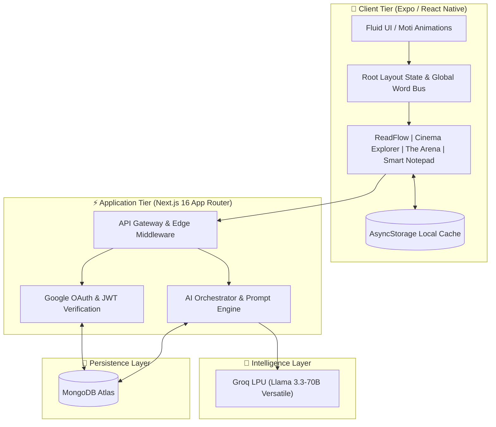

### 🔄 Word Tap Request Lifecycle

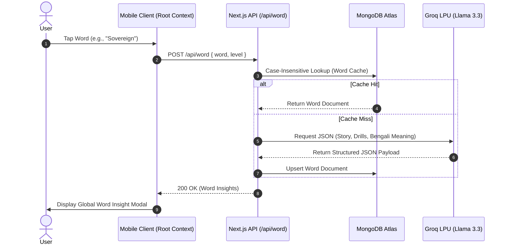

---

## 🛠️ Technology Stack

| Domain | Technology | Description |
| :--- | :--- | :--- |
| **Mobile Client** | **React Native (0.76)** | Native multiplatform runtime |
| | **Expo (SDK 54)** | Tooling, native modules, and OTA pipeline |
| | **Expo Router (v6)** | File-based declarative routing |
| | **NativeWind & Tailwind CSS** | Utility-first styling with responsive design |
| | **Moti & Reanimated 3** | Physics-based fluid UI animations |
| | **Lucide Icons** | Crisp vector iconography |
| | **Expo Speech & AV** | TTS audio synthesis & synchronized video playback |
| | **AsyncStorage** | High-speed local cache & offline state sync |
| **Backend & APIs** | **Next.js 16 (App Router)** | High-throughput serverless API routes |
| | **TypeScript 5** | Strict end-to-end type safety |
| | **Mongoose 9** | Strict ODM over MongoDB documents |
| | **Google Auth Library** | Cryptographic ID token verification |
| | **Edge Middleware** | CORS governance & security headers |
| **Artificial Intelligence** | **Groq LPU Engine** | Sub-second inference hardware acceleration |
| | **Llama 3.3-70B-Versatile** | High-reasoning LLM for grammar decomposition & drills |
| **Database & Cloud** | **MongoDB Atlas** | Distributed document persistence |
| **Testing & Quality** | **Jest & ts-jest** | Unit and integration testing |
| | **WebdriverIO & Allure** | Automated cross-platform E2E testing |
| | **Selenium Python** | Headless browser & user journey automation |

---

## 📡 RESTful API Reference

### 1. Vocabulary & Linguistic Intelligence

#### `POST /api/word`
Fetches or generates a word's educational package.
```json
// Request Body
{
  "word": "resilient",
  "level": "C1"
}

// Response (200 OK)
{
  "word": "resilient",
  "level": "C1",
  "phonetic": "/rɪˈzɪl.jənt/",
  "partOfSpeech": "adjective",
  "bengaliDefinition": "স্থিতিস্থাপক / প্রতিকূলতা কাটিয়ে উঠতে সক্ষম",
  "story": "Despite facing severe financial constraints, Sarah remained resilient and graduated with honors.",
  "drills": [
    {
      "sentence": "She showed a resilient spirit after the crisis.",
      "explanation": "Describing mental fortitude and recovery."
    }
  ]
}
```

#### `POST /api/clause-analyze`
Performs syntactic clause decomposition on complex sentences.
```json
// Request Body
{
  "sentence": "Although it was raining heavily, they decided to start the trek."
}
```

---

### 2. AI Learning Processor & Notes

#### `POST /api/ai/process-note`
Executes intelligent note transformations.
| Action | Purpose |
| :--- | :--- |
| `fix` | Corrects grammatical and syntax errors |
| `summarize` | Condenses content into bulleted takeaways |
| `expand` | Elaborates ideas with relevant academic context |
| `simplify` | Rewrites text into CEFR A2/B1 proficiency |
| `translate` | Produces natural Bengali translation |

#### `GET /api/notes?email=user@example.com`
Retrieves all synchronized notes for a user.

#### `POST /api/notes`
Creates or updates a note with real-time debounced autosave.

#### `DELETE /api/notes/:noteId`
Deletes a specific note.

---

### 3. Media, Reading & Gamification

| Endpoint | Method | Description |
| :--- | :---: | :--- |
| `/api/movies` | `GET` | Retrieves indexed movies with dialogue count |
| `/api/movies/translate-line` | `POST` | Translates a specific subtitle line to Bengali |
| `/api/books` | `GET` | Fetches reading passages and chapters |
| `/api/lexflow` | `GET` | Returns serialized literary passages |
| `/api/user/xp` | `POST` | Atomically increments user XP & updates level |
| `/api/leaderboard` | `GET` | Aggregates the top 10 users ranked by total XP |

---

## 💾 Database Schema Blueprint

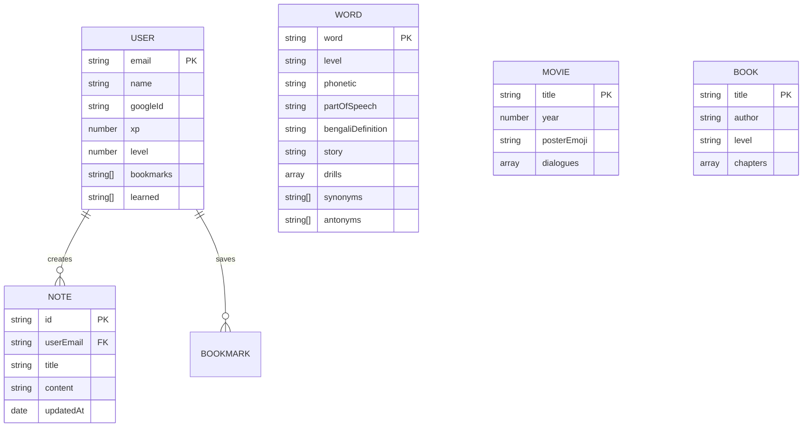

---

## 🚀 Getting Started & Local Development

### Prerequisites
* **Node.js**: `v18.x` or higher
* **npm** / **yarn** / **pnpm**
* **MongoDB Atlas** account or local MongoDB instance
* **Groq API Key** ([console.groq.com](https://console.groq.com/))
* **Expo CLI**: `npm install -g expo-cli`

---

### 1. Repository Clone
```bash
git clone https://github.com/ranehal/VocabVortex.git
cd VocabVortex
```

---

### 2. Backend Setup (`/server`)

```bash
cd server
npm install
```

Create a `.env` file in the `server` directory:
```env
# MongoDB Connection
MONGODB_URI=mongodb+srv://<username>:<password>@cluster.mongodb.net/vocabvortex

# AI Engine (Groq LPU)
GROQ_API_KEY=gsk_your_groq_api_key_here

# Authentication
GOOGLE_CLIENT_ID=your_google_client_id.apps.googleusercontent.com
JWT_SECRET=your_jwt_super_secret_key
```

Run the backend development server:
```bash
npm run dev
# Server will start on http://localhost:3000
```

---

### 3. Mobile Setup (`/mobile`)

```bash
cd ../mobile
npm install
```

Configure backend connectivity in `mobile/constants.js` if deploying to a physical device or simulator:
```javascript
export const BASE_URL = Platform.OS === 'web' 
  ? 'http://127.0.0.1:3000' 
  : 'http://<YOUR_LOCAL_IP>:3000';
```

Launch the mobile client with Expo:
```bash
# Start in Web mode
npm run web

# Start with Android Emulator
npm run android

# Start with iOS Simulator
npm run ios
```

---

### ⚡ 1-Click Windows Launchers
For rapid Windows local development, use the bundled batch scripts:
* **`RunVortex.bat`**: Resolves port conflicts (`:3000`, `:8081`), starts the Next.js server, and boots Expo Web with a clean cache.
* **`DeployVortex.bat`**: Verifies git status, stages modifications, and deploys updates to the remote repository.

---

## 🧪 Testing & Quality Assurance

VocabVortex includes an exhaustive multi-tier testing pipeline:

```bash
# 1. Run Backend Unit & Integration Tests
cd server
npm test

# 2. Run Python Selenium User Journey Tests
cd ../tests/selenium_python
pip install -r requirements.txt
python selenium_test.py

# 3. Run WebdriverIO End-to-End Suite
cd ../tests/e2e
npm install
npm test
```

---

## 🗺️ Project Roadmap

- [x] **Sub-second AI Word Engine** with Groq Llama 3.3.
- [x] **Cinematic Dialogue Explorer** with subtitle synchronization.
- [x] **ReadFlow Passage Engine** with real-time clause analysis.
- [x] **Gamification Arena** with Daily Boss and Speed Match.
- [x] **Smart Learning Notepad** with multi-action AI edits and TTS.
- [ ] **Real-Time Multiplayer Arena:** Live head-to-head 1v1 vocabulary battles via WebSockets.
- [ ] **AI Pronunciation Coach:** Speech-to-Text (STT) phonetic feedback comparing learner audio with native audio.
- [ ] **Custom Document Ingestion:** Import PDF and EPUB files for automatic CEFR vocabulary highlighting.
- [ ] **On-Device Offline AI:** Lightweight ONNX models for offline grammar checks and vocabulary lookups.

---

## 🤝 Contributing

Contributions make the open-source community thrive. Any contributions you make are **greatly appreciated**.

1. **Fork the Project**
2. **Create your Feature Branch** (`git checkout -b feature/AmazingFeature`)
3. **Commit your Changes** (`git commit -m 'Add some AmazingFeature'`)
4. **Push to the Branch** (`git push origin feature/AmazingFeature`)
5. **Open a Pull Request**

---

## 📄 License

Distributed under the **MIT License**. See `LICENSE` for more information.

---

<div align="center">
  <b>Built with ❤️ by <a href="https://github.com/ranehal">Nehal & the VocabVortex Team</a></b><br>
  <sub>Master words. Expand horizons. Enter the Vortex.</sub>
</div>
